<p align="center">
  <h1 align="center">AngularFireBlog</h1>
  <p align="center">A personal blog system using Angular cli + Firebase</p>
</p> 


[](/LICENSE) 


### Keyword
> `Angular` `Firebase` `FIrestore` `Personal Blog System` `NoSQL` `TypeScript` `AngularFire2`


## Contents 
<!-- toc -->
* [Introduction](#introduction)
* [Environment](#environment)
* [Installation](#installation)
* [System Structure](#system-structure)
* [Author](#author)
* [Function](#function)
* [Screenshots](#screenshots)
* [Contact](#contact)
* [License](#license)

<!-- toc stop -->


## Introduction

Our project is a Personal Blog System. Blog’s admin can log in the system and can add/delete/edit the articles. Other users can browse the articles. 

The main purpose of our project is to design and implement a personal blog system. Although there are many useful blog systems on the internet, they have less custom design and settings and not all of them support markdown editing. What’s more, we implement our blog system using AngularFire framework that the system are more comprehensive. As a result, we can manage our own data in the cloud database. Every user keeps their accounts only. It protect the privacy compare to the existing blog system on the internet. In addition, we can design our blog style and layout whatever we like.
 
Above the main blog body, there is a character called Waddle Dee. We design an animation that Waddle Dee sways in the wind and comes down in a parachute, leading you to our blog when he lands in the ground. In the blog body, there are different categories, each category contains different articles. Users can view the full article, click the like button and make comments.

In the “add post” page, admin can add his/her own articles. Our blog system also supports markdown. Administrator can use markdown editor online to write the post. In addition, the post can be displayed in markdown format.

In each post, admin can edit or delete the post and update it to the cloud database when pressing the “edit” or “delete” button. Other users can like or comment the post.

Compared to other blog system on the internet, there is no advertisement and other social media contents in our blog system, which provides more neat and clear posts sharing and reading experience for user.


## Environment
- MacOS: 10.14.1 <br>
- Angular CLI : 7.0.6 <br>
- Nodejs: 8.12.0 <br>
- Firebase-tools: 6.1.2 <br>
- Visual Studio Code 

#### Quick Links
- [AngularFirebase Document](https://angularfirebase.com)
- [AngularFire Document](https://github.com/angular/angularfire2)
- [Firebase Document](https://firebase.google.com/docs/guides/?authuser=0)
- [Angular CLI](https://github.com/angular/angular-cli)
- [Firebase Cli Document](https://github.com/firebase/firebase-tools)
- [Angular Document](https://angular.io/guide/quickstart)

### Learning AngularFire with Video
- [Angular + Typescript = Powerful Web App](https://www.youtube.com/watch?v=0akfix87OdE&t=715s)
- [Angular Cli Tutorial for Beginner](https://www.youtube.com/watch?v=k5E2AVpwsko)
- [Learn Angular 6 in 60 minutes](https://www.youtube.com/watch?v=z4JUm0Bq9AM&t=97s)
- [AngularFire Quickstart](https://www.youtube.com/watch?v=-GjF9pSeFTs)
- [Firebase Web App Tutorial (Part 1-4)](https://www.youtube.com/watch?v=F6UWb9FNnj4&t=746s)
- [Hosting of Firebase](https://www.youtube.com/watch?v=xmlzSgAfToY)
- [Deploy Angular to Firebase](https://www.youtube.com/watch?v=kNEw8aP513E)
- [Cloud Firestore Tutorial](https://www.youtube.com/watch?v=0Nah3foeyCM&t=166s)
- [Getting Start with Cloud Firestore on the web](https://www.youtube.com/watch?v=2Vf1D-rUMwE)
- [Firebase Firestore Tutorial](https://www.youtube.com/watch?v=kmTECF0JZyQ)

## Installation

### 1. Clone Repo

```bash
$ git clone git@github.com:tavik000/AngularFireBlog.git
```

### 2. Download NodeJS

Refer [NodeJS official website](https://nodejs.org/en/download/) to download it

### 3. Download Angular Cli

```bash
$ npm install -g @angular/cli
```

### 4. Development server

Run `ng serve` for a dev server. Navigate to `http://localhost:4200/`. The app will automatically reload if you change any of the source files.

### 5. Download Firebase-tools (Optional for connect your own firebase app)

```bash 
$ npm install -g firebase-tools
```

### 6. Deployment (Optional)

#### Build you project into dist/
```bash
$ ng build -prod
```

#### Login your Firebase Account

```bash
$ firebase login 
```

#### Init a Firebase deployment

```bash
$ firebase init
``` 
<br>
For the public directory, enter /dist/_YourProjectName/
<br>
In this case, /dist/AngularFireBlog3/
<br>
Asking about replace index.html, type No


#### Deploy your AngularFire program
```bash
$ firebase deploy
```


## System Structure

### Use Case <br>
There is some diagrams for the system structure. 

Here is the use case diagram. It specify that User can view the post in the our blog system. and the Admin can manage the post in the blog system.


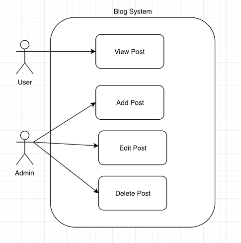 <br>
### Workflow <br>

Here is a system flowchart below. in this diagram. User open our website, then scrolling down from the sky to the ground, then user can see our blog. at this point, when user want to look for post by category. they can click the button on the navigator bar, and select category. After that, they can see the post thumbnail after filtering. By clicking into the post, user can view the whole post and see every detail of the post. they can like the post by clicking the button and add comment.
If the user is admin. they can login the system by click the login button. If they cannot pass the authentication verification. Then they can browse the posts only. If the Admin login the system successfully. they can add, edit, delete post directly by clicking different button. they can logout the system and view the post like normal user.

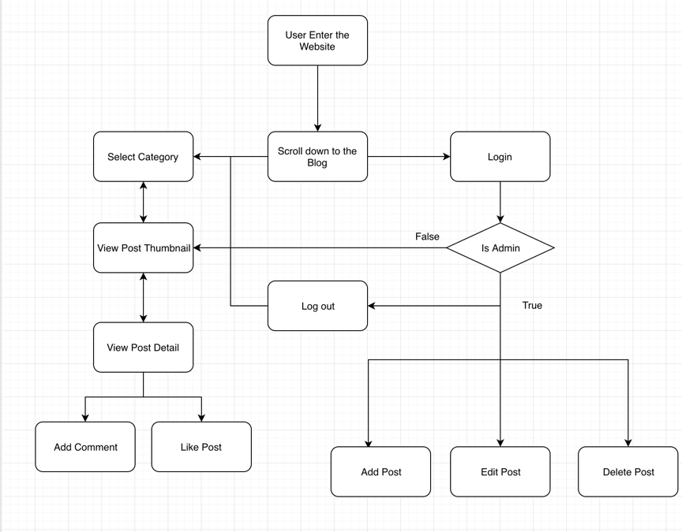 <br>
### Flowchart <br>
Here is a flowchart specify that how our system interact with MVC component as well as database. For the users, when the user enter our website. The controller will send a trigger request to model for getting post data from database. After getting data, the model render the post data to the view so the user can see the posts in the website. and when they click the category button, it process in the similar way. the only different is the interaction with data model. for example, the category function filter use the where() function provided by firestore API. 
As for the admin. they add or edit the post by sending a request and interact with the data model with sending the data from the view. then the model update the database. The delete is send a request for deleting post with ID and update database.

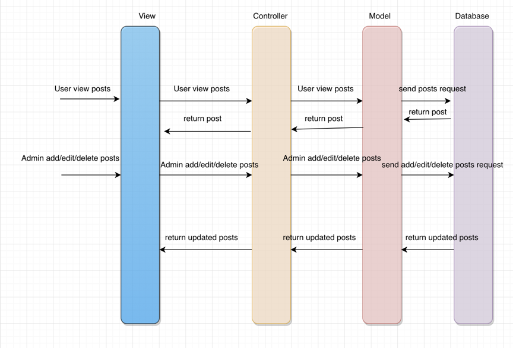 <br>
### Class Diagram <br>
This is a class diagram of our database. It contain a Post. and It refer to the Interface <<Post>> and contain value of id, title, author, body, category, createDate, likes, commentCount, image. And have 8 method. the syncModel() is for the markdown editing, which bind the value of the text field to the markdown component and display. the onSelect() function determine which post are being selected and showed the post’s detail. FilterByCat() function is for the category filtering. deletePost() function is for deleting post. addLike() is for adding a likes for a post. addNewPost() function is for adding new post. editPost() is for submit the edited post and update. onShowFieldState() function is for determine now what element should be showed such as post’s thumbnail, post’s detail, post’s editor for adding new post,  post’s editor for editing post. the other class is quite simple to be understand. User is for the login component. only Admin can manage post. it contain some basic information, email and id. The comment is storing the comment. It is a subcollection in the document. Meaning that each comment is a document of a subcollection of a post’s document.  comment have one Post. Each post can have 0 to many comment. Each user have 0 to many comments, each comment have only 1 user. each user have 0 to many post. Each post has one user.
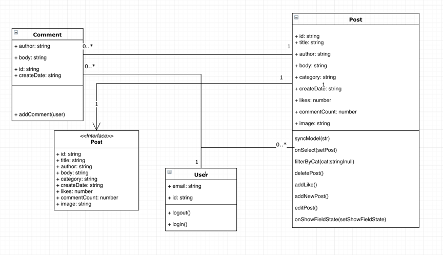 <br>


## Author
- [Key](https://github.com/tavik000) <br>
- [CY](http://www2.comp.polyu.edu.hk/~18073824g/) <br>

## Function


### CSS & JavaScript Animation
This website contains a CSS animation. After scrolling down, it will display the blog page. The animation are purely using CSS and Javascript. All element such as cloud, character, parachute, sky, grass are design by using CSS. and it is no image for the scene. For using the Angular, we here use Typescript instead of JavaScript for these animation. Give these codes for example. we detect the waddle dee landing in the ground by detect the position and the ground position. and add a class to waddle dee making it sitting in the grass and waving his hands.


### Blog body

The blog system contains different modules and functionalities:

### Login and logout
If it is not admin user, there is a login button. When user clicks the login button, it will jump to the Google account login page. If login success, the blog title will display user’s blog name. Also, there is a logout button. Otherwise, it will display “you are not admin!”.

All these are implemented by the “LoginComponent” in Angular. In this component, it will verify user’s email. Only if it matches the account of Firebase database account, user can login.


### Post categories
There are many categories and each category contains different posts. In “All” category, it will list all posts of the blog owner. When click the posts of other categories, it will display the selected post.

These categories are dropdown buttons. When hovering the button, it will show different categories of the posts. If there is no post in the category, it will return “no result”.


### Add post
There is an “Add Post” button. When the admin clicks this button, it will show the add post field. In our project, we support markdown format edit. Once click the “Add Post” button, the new post can be upload to cloud database.


### Posts list
It will display all the posts here. It simply shows the main information of each post, such as title, body, comments and likes. When click the particular post, it will show the whole post. 


### View post
When open a post, it will display the post in markdown format. Each post contains a big post image, author, create date and the post body. 


### Edit/delete post
Only if the users login our system the edit/delete button will display. It will have a fade in and out effect when the mouse hovers the post. Click the “edit” icon button can open the markdown edit page. When save the post, it will upload to the cloud database. Click the “delete” icon button, it will delete this post from the cloud database.


### Add comments
Under the comments, there is a “Add comment” field. Users can make comments of the post. All users can add comments whether he/she is an admin or not. When click the “Add a comment” button, the name as well as the comment will be sent to the cloud database and immediately displayed on the comments area under this post. In addition, our blog can display the number of comments. In the comment field, there are lists of comments with names and contents.


### Add likes
Under the post, there are many comments of the post. And there is a “like” button. Other users can like the post even they don’t log in our blog system. When user clicks the like button, the likes count will add one and the heart icon will turn red. Besides, users can not press like button again.


## Screenshots

 <br>
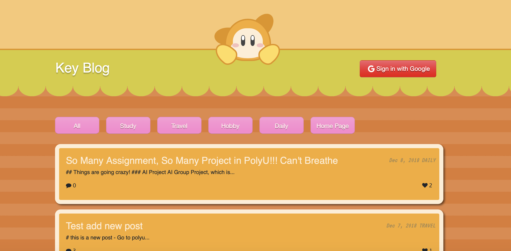 <br>
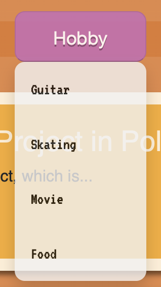 <br>
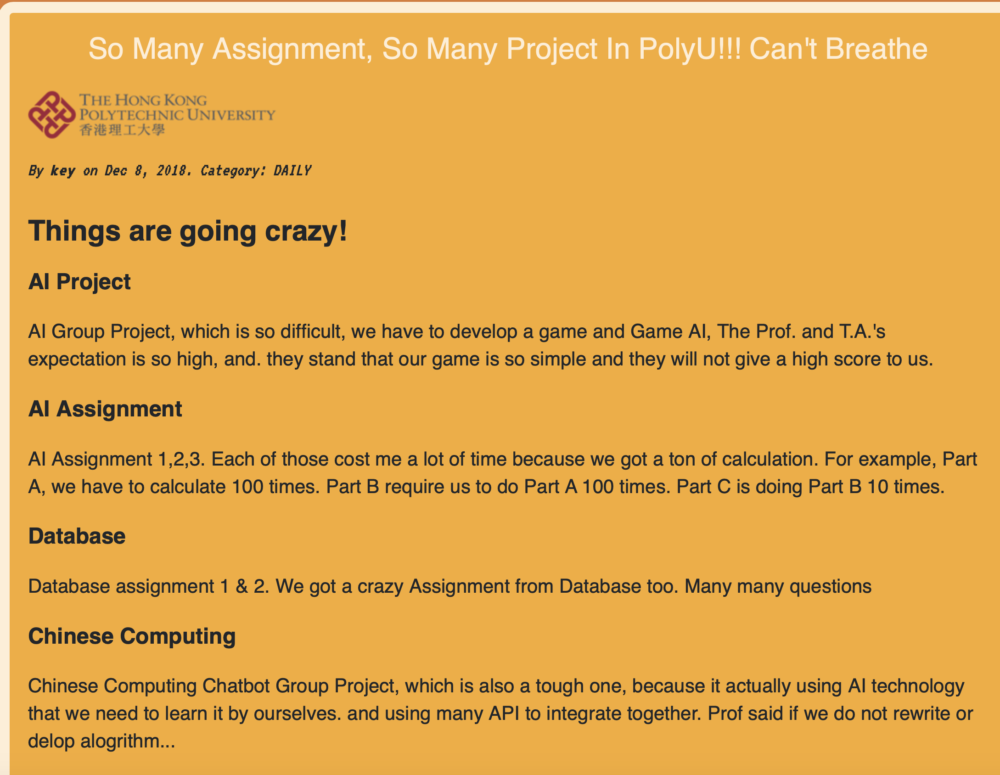 <br>
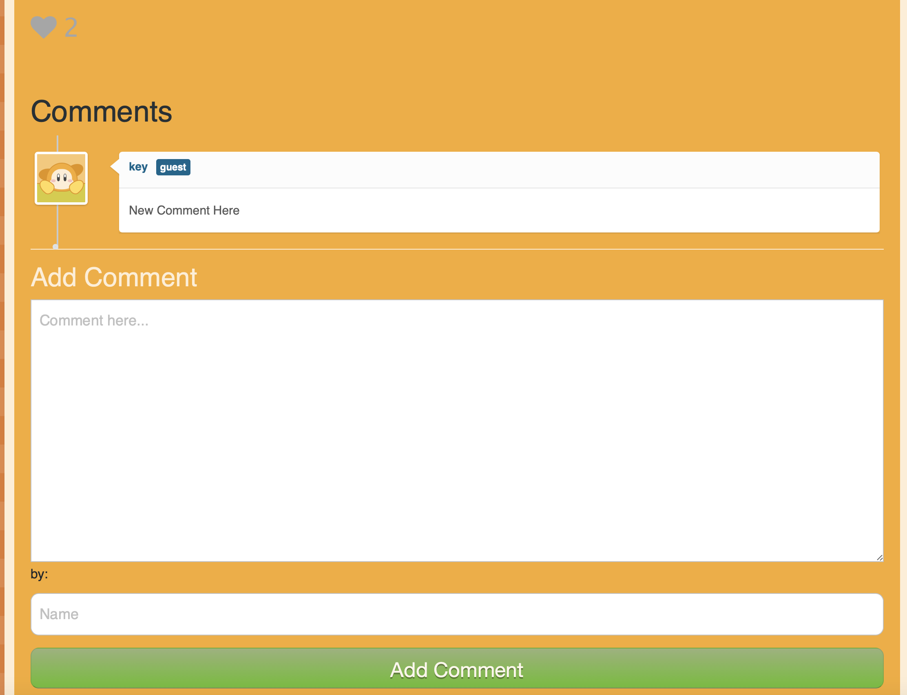 <br>
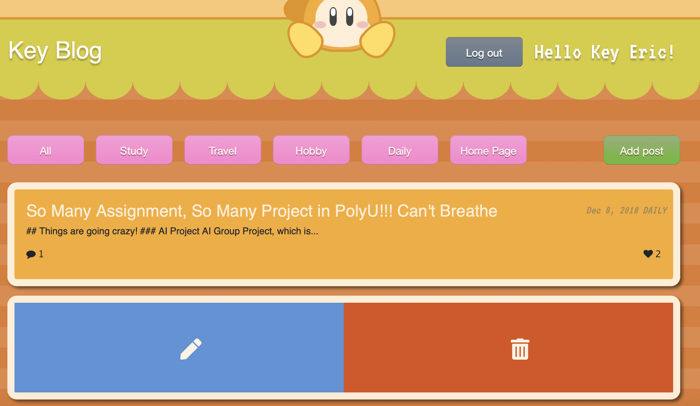 <br>
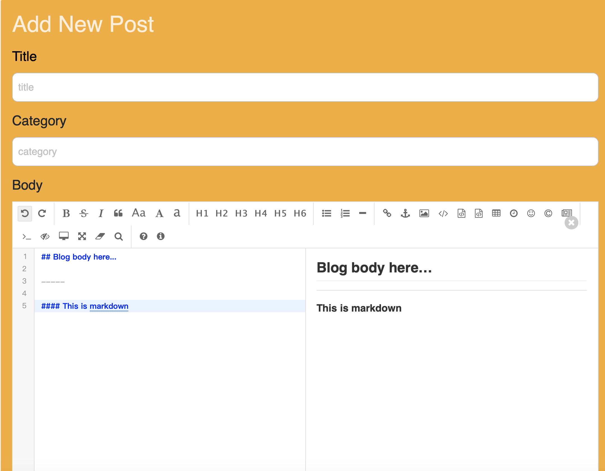 <br>
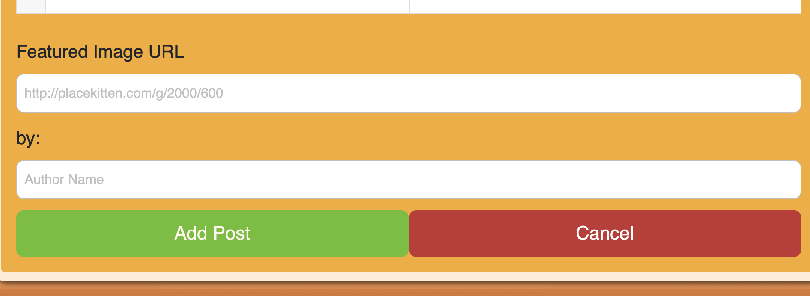 <br>
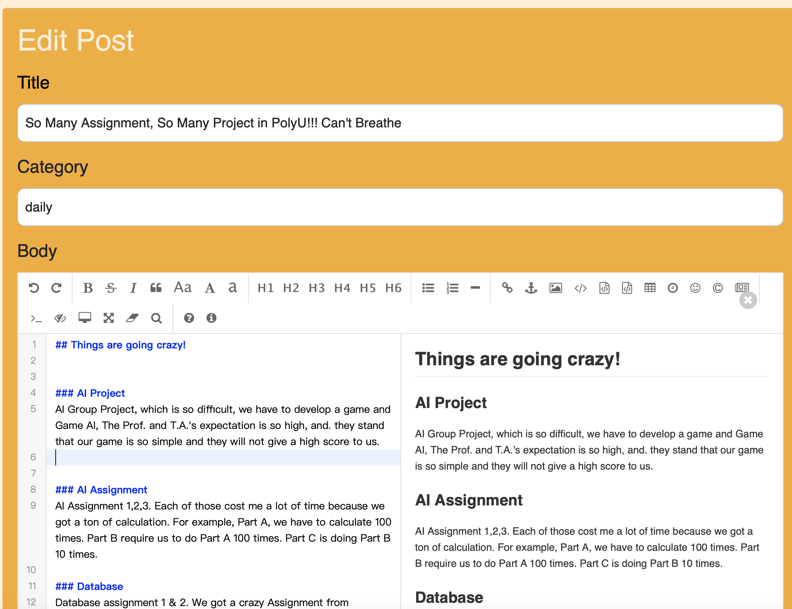 <br>
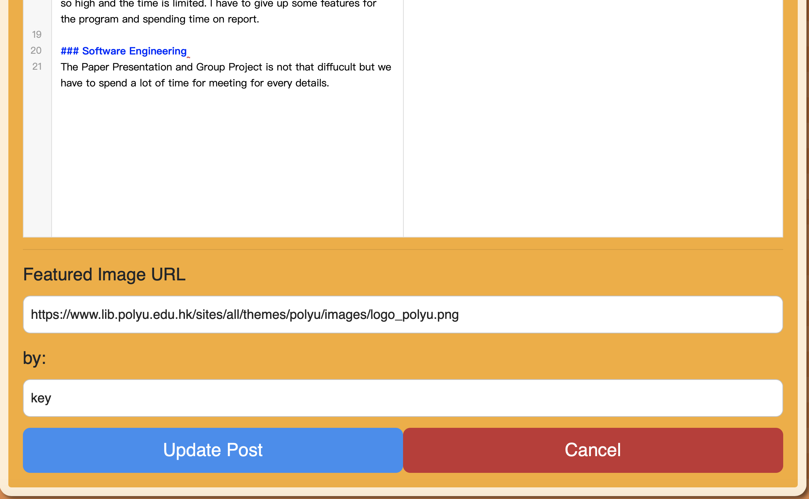 <br>


## Other Info about Angular Cli

### Code scaffolding (Optional)

Run `ng generate component component-name` to generate a new component. You can also use `ng generate directive|pipe|service|class|guard|interface|enum|module`.

### Build (Optional

Run `ng build` to build the project. The build artifacts will be stored in the `dist/` directory. Use the `--prod` flag for a production build.

### Running unit tests

Run `ng test` to execute the unit tests via [Karma](https://karma-runner.github.io).

### Running end-to-end tests

Run `ng e2e` to execute the end-to-end tests via [Protractor](http://www.protractortest.org/).

### Further help

To get more help on the Angular CLI use `ng help` or go check out the [Angular CLI README](https://github.com/angular/angular-cli/blob/master/README.md).


**If you like this, please leave a star.**

-----


## Contact


Email:  Key <tavik002@gmail.com>

-----
## License
MIT License

Copyright (c) 2018 key

Permission is hereby granted, free of charge, to any person obtaining a copy
of this software and associated documentation files (the "Software"), to deal
in the Software without restriction, including without limitation the rights
to use, copy, modify, merge, publish, distribute, sublicense, and/or sell
copies of the Software, and to permit persons to whom the Software is
furnished to do so, subject to the following conditions:

The above copyright notice and this permission notice shall be included in all
copies or substantial portions of the Software.

THE SOFTWARE IS PROVIDED "AS IS", WITHOUT WARRANTY OF ANY KIND, EXPRESS OR
IMPLIED, INCLUDING BUT NOT LIMITED TO THE WARRANTIES OF MERCHANTABILITY,
FITNESS FOR A PARTICULAR PURPOSE AND NONINFRINGEMENT. IN NO EVENT SHALL THE
AUTHORS OR COPYRIGHT HOLDERS BE LIABLE FOR ANY CLAIM, DAMAGES OR OTHER
LIABILITY, WHETHER IN AN ACTION OF CONTRACT, TORT OR OTHERWISE, ARISING FROM,
OUT OF OR IN CONNECTION WITH THE SOFTWARE OR THE USE OR OTHER DEALINGS IN THE
SOFTWARE.


[⬆ Back to top](#contents)

**All Copyright Reserved**
